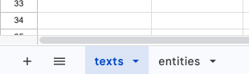
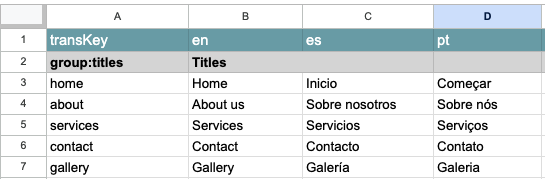
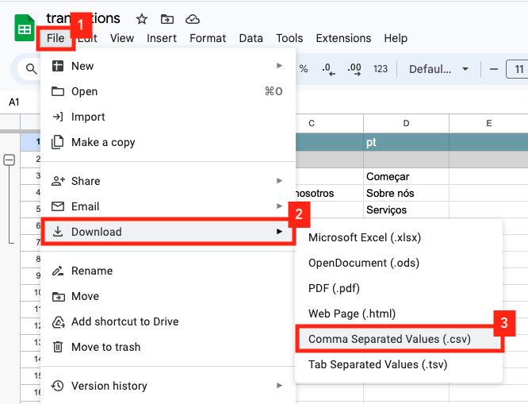
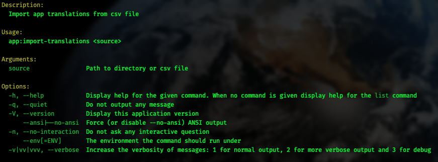

# novadaemon/laravel-csv-translations

This Laravel package provide a command that allow to generate your lang files from csv files.

## Instalation

You can install the package via composer:

```bash
composer require novadaemon/laravel-csv-translations
```

This package supports Laravel 9 and Laravel 10.

## Prepare your translations database

In this link you can find the Google Sheet [translations](https://docs.google.com/spreadsheets/d/1fhFURddF7EY6pZfigmxxzIZnZsHCfnT89VdziqmYAVY/edit?usp=sharing) which contains examples of how you can store the translation strings of your Laravel application.

As you can see, the name of this Google Sheet is **translations** and it is very important that you do not change this name. If you do, the import translations command fails.

If you open the file you will see that it has two sheets: **texts** and **entities**. You can add many sheets as you can need.



In row number 1 is the keyword *transKey* in column A, followed by the languages supported by your application in the other columns. You can add as many language columns as you like.



Once you finish completing your translation strings, all you need to do is download the sheets as csv files.



Continuing with the example, this action will download a file with the name **translations - texts.csv**.

## Import translations

To import and generate the translation string files you just have to run the command `php artisan app:import-translations`

```shell
php artisan app:import-translations --help
```



As an argument to the command you must pass the path to the csv file or the directory that contains the csv files with the translations.

```shell
php artisan app:import-translations "path/to/translations - texts.csv"
```

Running the above command creates the translation file in the **lang** directory of your Laravel application.

Ex.:

`lang/en/texts.php`

```php
<?php 
return [
  'titles' => 
  [
    'home' => 'Home',
    'about' => 'About us',
    'services' => 'Services',
    'contact' => 'Contact',
    'gallery' => 'Gallery',
  ],
];
```

`lang/es/texts.php`

```php
<?php 
return [
  'titles' => 
  [
    'home' => 'Inicio',
    'about' => 'Sobre nosotros',
    'services' => 'Servicios',
    'contact' => 'Contacto',
    'gallery' => 'Galería',
  ],
];
```

`lang/pt/texts.php`

```php
<?php 
return [
  'titles' => 
  [
    'home' => 'Começar',
    'about' => 'Sobre nós',
    'services' => 'Serviços',
    'contact' => 'Contato',
    'gallery' => 'Galeria',
  ],
];
```

## Contributing

Contributing is pretty chill and is highly appreciated! Just send a PR and/or create an issue!

## Credits

- [Jesús García](https://github.com/novadaemon)

## License

The MIT License (MIT). Please see [License File](LICENSE.md) for more information.